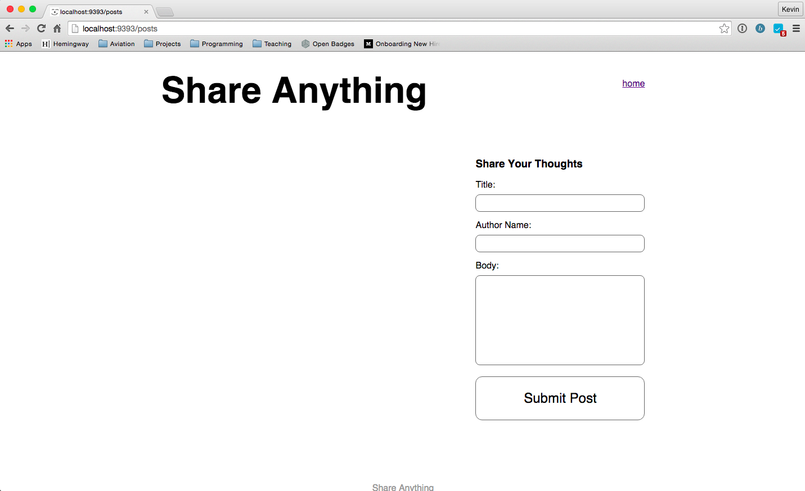
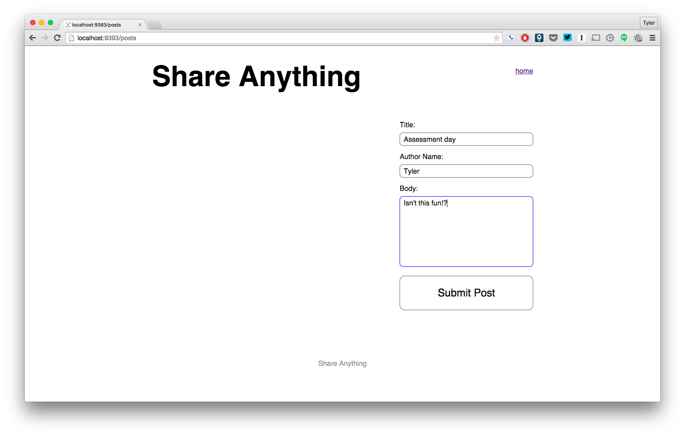
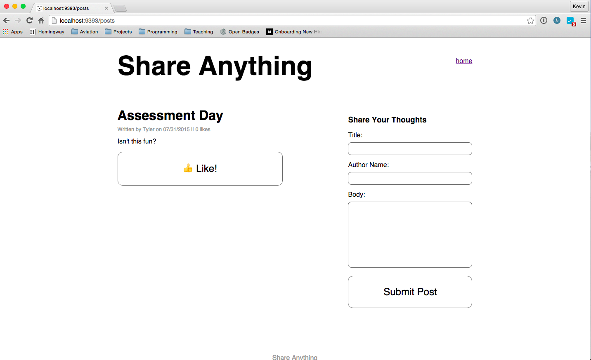
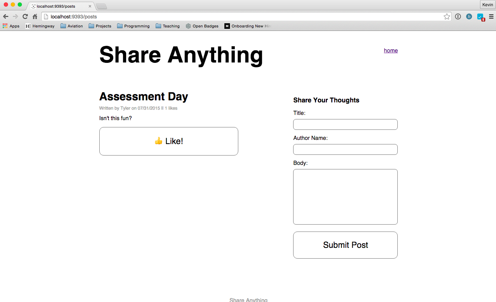

# Part 2:  AJAX

## Summary
In Part 2 we'll take a functioning Sinatra application and enhance the user experience by adding some AJAX calls.

### User Stories
#### Current Site

The application is a simple site where users can write posts.  If a user wanted to write a post, here's the process.

User visits the site root.



User fills out and submits the form.



User is taken back to the posts page where the saved post is displayed.



#### Future Site

Our enhancements will make it so the user never leaves the homepage.  All the requests will be AJAX requests, and we'll update the DOM based on the responses.  After the site is updated, here's what the user experience will be.

User visits the site root.


User clicks "Share Your Thoughts" and the form appear (without refreshing).


User fills out and submits the form. Details of the saved post are added to the DOM (without refreshing).



Note that the form is also reset to allow another post.

##### Liking
In addition to AJAXifying the site, you should add the ability for users to "like" a post. This flow will again keep the user on the same
page.

1. User visits the site root.
1. User clicks on a like button.
1. The "like" count is incremented on the DOM.

### Testing
Feature tests are provided in Part 2 of the assessment to guide our enhancement efforts. These types of tests might be unfamiliar.  We don't need to understand how to set up or write such tests.  We'll just use them as a guide.

## Releases
### Pre-release:  Setup
We'll need to make sure that everything is set up before we begin working on the application.  From the command line, navigate to the `part-2` directory of the phase 2 assessment.  Once there, run ...

0. `$ brew update && brew install phantomjs`
0. `$ bundle`
0. `$ bundle exec rake db:create`
0. `$ bundle exec rake db:migrate`
0. `$ bundle exec rake db:migrate RACK_ENV=test`

### Release 0: AJAX
Now we'll take our application and enhance its functionality.  But, we don't want to break our functioning site in the process.  Fortunately, there are tests to help us.  Tests have been written to describe the `Post` class (see `spec/models/post_spec.rb`) and the feature of writing a new post (see `spec/features/writing_a_post_spec.rb`).

The feature tests for writing a new post include two contexts:  without javascript and with javascript.  The code you are provided with will pass the scenarios where javascript is not being used.  The with-javascript scenarios fail with just the provided code.  

Our task is to make the with-javascript scenarios pass.  When our site is functioning properly with AJAX, all scenarios should pass.  Don't break the without-javascript test to pass the with-javascript test.

To run the tests and see the with-javascript feature test fail, from the command line, run ...

```
$ bundle exec rspec
```

Use the failing scenario and future-site user story from the *Summary* to guide your development until all the tests pass.

## Conclusion
Once all the tests have passed, you have completed Part 2 of the assessment. If you haven't done so already, commit your changes and move on to Part 3.
